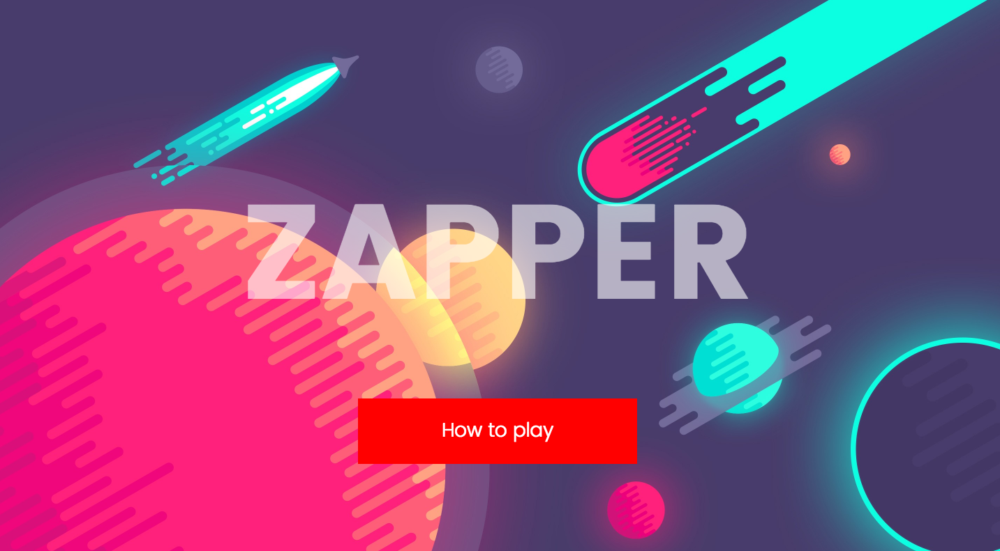
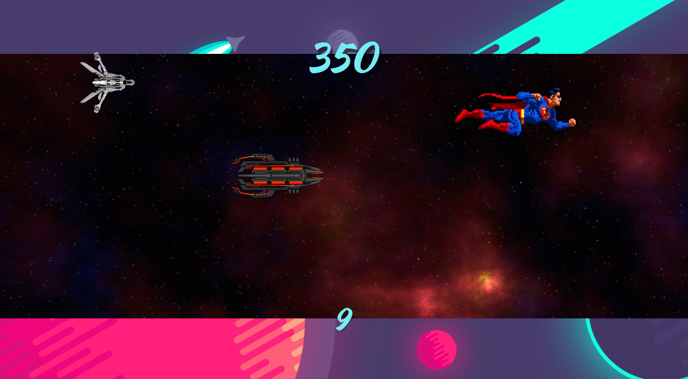

# ZAPPER

A timed shooter game

###How to play

Each button on the page scrolls down to the next section

Type your name into the iput box on the "How to play" section.

#####You have 25 seconds to click as many targets as possible.

Each target is worth 50 points.

#####The game starts on level 1 and as you gain points you move up levels:

* **Level 2** = 500 points
* **Level 3** = 1000 points

The targets get quicker as you move up levels.

Once the timer has finished, either scroll down or click on the animated chevron to view a list of your session score.

Click "Play Again" to reset the timer and go again. 

###How it was made

HTML, CSS and Jquery

I started off by using HTML to build the basic frame of the game, and add layers such as the landing page and gameboard. I then added the elements that would be involved in the actually game part, knowing that they would be added/hidden later in the development stage with JQuery.

I then used CSS to create a basic stage so I could visualise how the game would function.

JQuery was then used to program the functionality of the game. Majority of the functionality is based on click events which trigger animations, scrolls and sounds.

Finally, I updated the CSS to get the look I wanted and built on it to make sure that the game was responsive and worked on various devices.

###Issues

I had one main issue when developing the game. 

I intended on creating a leaderboard at the bottom of the page which updated after each game was played. The scores would be displayed in order (Highest to Lowest). I couldn't quite wrap my head around it in time so decided to leave it as is.